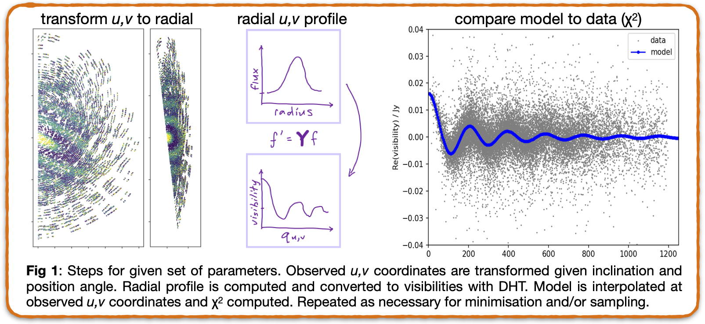

vis-r
-----

`vis-r` is a method and the associated code for rapid radial profile modelling of interferometric visibilities.
The article in RASTI outlines the method (summarised in the figure below), and this repo contains some code,
which may be sufficient for what you want. If it isn't you can roll your own, and if you need help please ask!



The `vis-r` executable in the install below will model multiple sets of 
visibilities exported from an ms file (try `python hello_world.py` in the examples folder). There are `stan` and `python/emcee` 
versions that are generally the same, but with minor differences.
Both assume a single disk plane, but can include multiple radial components 
with independent vertical scales, though these must all be of the same type 
(e.g. Gaussian, power). Each set of visibilities can have independent offset
parameters in the `emcee` version.  Compact central star, point, and Gaussian
sources can also be included.

All of this is fairly easy to change for your use case, e.g. a model with multiple disk components
could also have independent orientations for each. If you make such changes let
me know since they could be helpful for others. 

### Install

Install the most recent commit on an M2 Mac with `conda`,
which will create the shell command `vis-r` (`frank` wants scipy<1.12):
```shell
CONDA_SUBDIR=osx-arm64 conda create -n vis-r -c conda-forge python emcee matplotlib scipy=1.11.4 multiprocess arviz corner pytest numpy cmdstanpy ipython arviz jupyter
conda activate vis-r
pip install https://github.com/drgmk/vis-r/archive/refs/heads/main.zip
```

If you are likely to fiddle with the code, e.g. to add new radial profile functions,
it is better to clone the repo into a folder, `cd` into it, and install `vis-r`
with `pip install -e .`. Calls to the installed `vis-r` executable will use the code
in this folder.

### Fitting

First, export your visibilities from the ms file to a text or numpy file.
Examples that do this are [here](https://github.com/drgmk/alma/blob/a10e4e40e84ff3a25dfa3b0067fec5f4c3713b1d/alma/casa.py#L226)
and [here](https://github.com/dlmatra/miao/blob/master/utils/mstonumpyortxt_multiple.py).
These will export whatever is in the ms, so discard any calibration and flagged data, and it is
best to do some averaging first (e.g. 30s time intervals, a few channels per spw) to keep the size of the exported file down.

Run the fitting on some visibilities like so
```shell
vis-r -v data/HD109573.12m*npy -g 0.012 -0.035 26.6 76.5 -p 0.013 1.07 0.06 0.01
```

or for the `stan` version, just add the `--stan` flag:

```shell
vis-r -v data/HD109573.12m*npy --stan -g 0.012 -0.035 26.6 76.5 -p 0.013 1.07 0.06 0.01
```
 The options for each version are mostly the same, but there are some differences.
 The `stan` version first estimates the parameter scales with the Pathfinder algorithm,
 and only the `emcee` version has independent astrometry fitting for 
 each visibility dataset `--astrom` implemented. Both default to the same number of 
 warmup/sampling steps, but `stan` will yield many more independent samples
 for a given number of steps.
 
To evaluate the model, viewing residuals is normally very helpful.
Subtract the best fit model (`*vismod.npy`) from the ms from which the visibilities
were exported, an example function is [here](https://github.com/drgmk/alma/blob/a10e4e40e84ff3a25dfa3b0067fec5f4c3713b1d/alma/casa.py#L82).

The suggested method of fitting is to initially use rather hard u,v averaging
with the `--sz` parameter, setting it to something similar to the disk size,
or even smaller. Runs should complete quickly, give reasonable parameter 
estimates, and an idea of whether the model fits the data well via subtraction
and creation of dirty images. Given some initial success, more robust posterior
estimates can be obtained with larger `--sz`, and either longer `emcee` runs 
or sampling with the `stan` implementation.